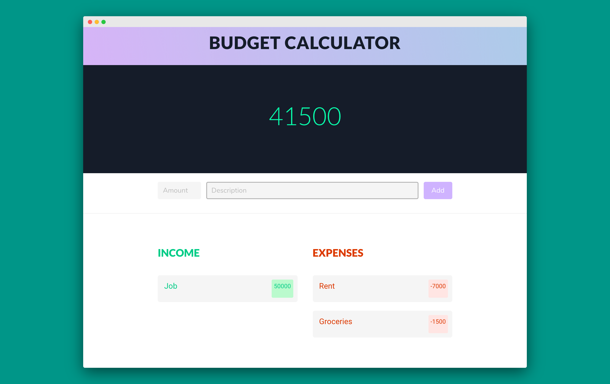

# BudgetApp
Angular app to manage your expenses

See the live version at [this link](https://budget-app-shubham.herokuapp.com/)

## Getting Started

The app is based on Angular

### Prerequisites

Angular client
```
$npm install -g @angular/cli
```

### Installing

Clone the repo then use

```
$npm install
```

To start the app use,

```
$ng serve
```

## Development server

Run `ng serve` for a dev server. Navigate to `http://localhost:4200/`. The app will automatically reload if you change any of the source files.

## Screenshots



## Built With

* [Angular](https://angular.io/) - Angular is a TypeScript-based open-source web application framework led by the Angular Team at Google and by a community of individuals and corporations.